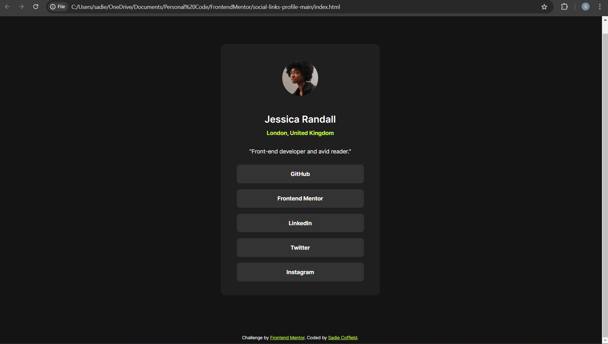

# Frontend Mentor - Social links profile solution

This is a solution to the [Social links profile challenge on Frontend Mentor](https://www.frontendmentor.io/challenges/social-links-profile-UG32l9m6dQ). Frontend Mentor challenges help you improve your coding skills by building realistic projects. 

## Table of contents

- [Overview](#overview)
  - [The challenge](#the-challenge)
  - [Screenshot](#screenshot)
  - [Links](#links)
- [My process](#my-process)
  - [Built with](#built-with)
  - [What I learned](#what-i-learned)
  - [Continued development](#continued-development)
- [Author](#author)

## Overview

### The challenge

Users should be able to:

- See hover and focus states for all interactive elements on the page

### Screenshot

### Links

- Solution URL: (https://github.com/sadiecoffield/social-links-profile.git)
- Live Site URL: (https://stirring-syrniki-c87f48.netlify.app/)

## My process

### Built with

- Semantic HTML5 markup
- CSS custom properties
- Flexbox
- CSS Grid
- Mobile-first workflow

### What I learned

I learned how to create a responsive website using a mobile-first workflow.

### Continued development

I want to improve my ability to use a mobile first workflow and improve on making my code as efficient as possible.

## Author

- GitHub - [sadiecoffield](https://github.com/sadiecoffield)
- Frontend Mentor - [@sadiecoffield](https://www.frontendmentor.io/profile/sadiecoffield)

